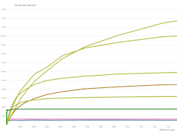
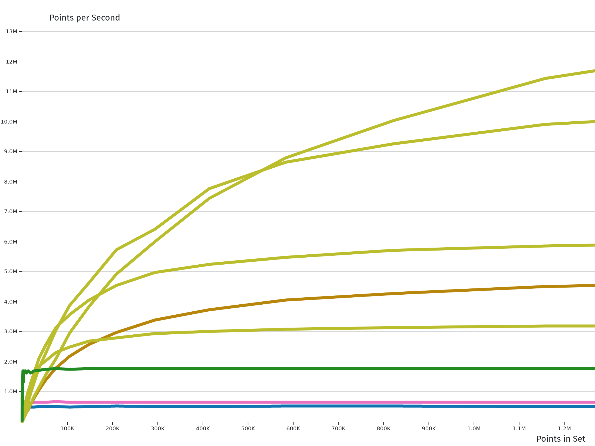

# H3 geo_to_h3 Benchmarks

Tools and examples of [h3](https://github.com/uber/h3-py)'s `geo_to_h3` function in larger quantities. `geo_to_h3` converts from a WGS84 Latitude/Longitude pair to an H3 hexagonal index at a given resolution.

[ Explore the benchmarks!](https://user01.github.io/h3-py-geo_to_h3/)

## TLDR

A pattern with the higher performance and no extra dependencies.

```python
import os
import numpy as np
from concurrent.futures import ThreadPoolExecutor
import h3.unstable.vect as h3_vect


_CPU_COUNT = os.cpu_count()

def vectorized(points: np.ndarray, resolution: int) -> np.ndarray:
    return h3_vect.geo_to_h3(points[:, 0], points[:, 1], resolution)

def geo_to_h3(points:np.ndarray, resolution: int, workers:int=None)->np.ndarray:
    workers = workers if workers else _CPU_COUNT
    payload = np.array_split(points, workers) if points.shape[0] > workers else [points]
    with ThreadPoolExecutor(workers) as executor:
        futures = [executor.submit(vectorized, pts, resolution) for pts in payload]
    return np.concatenate([f.result() for f in futures])
```

(Tested on py3.10 and h3 3.7.3. Roughly 1MM points/second per core. So if the machine has 8 threads, 8MM points per second. Please benchmark on hardware for real performance.)

## Best Technique

**Stability Risk**: Tolerance of the project to complex requirements. H3 labels the [vectorized API as unstable](https://github.com/uber/h3-py/issues/205), so if that dependency moves, h3 would break. Given a fixed dependency in a `Pipfile`, docker container, or similar, this risk would be low for a higher performance gain.

CUDA is a similar concern. Building and hardware requirements are non-trivial and there are rounding error differences in a small fraction of points, but the speed boost is significant (10x multithreading on a desktop). See the [h3cuda readme](/h3cuda_pkg) for more details.




The size of the set dictates the best performance as well. Threading and CUDA perform best on very large sets, but the set up penalty means other techniques can outperform for smaller sets.

## Benchmarks

Plotted [benchmarks can be found here](https://user01.github.io/h3-py-geo_to_h3/).

[](https://user01.github.io/h3-py-geo_to_h3/)

## Techniques

All techniques can be found in `h3_tools/` as python modules. The best performance for each is listed, but can vary based on set size.

### Baseline

The simplest implementation based on a quick reading of Uber's [h3-py](https://github.com/uber/h3-py). Noting that H3 is based around unsigned 64 integers, this converts to that form from the more readable python string that's returned by default.

`~500k pts/second` - `1.0x baseline`

### H3 API

A more detailed read of [Uber's H3 py documentation](https://uber.github.io/h3-py/api_comparison.html) shows the library can return the uint64 directly. The other formats (numpy/memoryview) are much more important for other aspects of the API, but `geo_to_h3` makes little use of them.


`~650k pts/second` - `1.3x baseline`

### Pandas

An obligatory use of pandas iteration. Pandas iterations are extremely convenient for a typical way data is represented in Data Science work, but are very heavy for any kind of iteration.

`~33k pts/second` - `0.066x baseline`

### Vectorized

[h3-py](https://github.com/uber/h3-py) offers a lightly documented [unstable vectorized](https://github.com/uber/h3-py/blob/v3.7.3/src/h3/unstable/vect.py) API to many of these functions. Note the 'unstable' label refers to the [API contract itself](https://github.com/uber/h3-py/issues/205), not the performance of the functions. Under the hood, the same code is being called. This merely bypasses the Python interpreter's for loop.


`~1.8MM pts/second` - `3.6x baseline`

### Multiprocessing

These make use of multiple cores. There are two techniques: processes and threads.

Threads share memory but processes don't. With the Python [GIL](https://realpython.com/python-gil/), threads cannot typically compute concurrently - only one can have the lock at a time. This makes working with threads much easier, but can limit concurrent processing such as this use case.

This is indeed what happens with the `threadpool` implementation. Despite creating many threads, only one can execute on the same memory at a time and there is no speedup (in fact a slight penalty for creating the thread pool).

The implementation of `geo_to_h3_vect` does not have this issue, as the [c code](https://github.com/uber/h3-py/blob/fd43513c905dfdab355573cc9f5b6c9806de164a/src/h3/_cy/unstable_vect.pyx#L53) releases the GIL. Therefore threads can work concurrently on the same piece of memory (the points).

The `pool_vector` implementation is more a traditional python solution to this issue. Data is shared to different python processes and returned to the main once completed. Multiple python processes, multiple GILs, no collision, but transfer time overhead.

`~16MM pts/second` - `32x baseline`

### CUDA

See the [readme](/h3cuda_pkg) for more details, but this technique modifies Uber's H3 implementation of c code for use on a CUDA GPU.

Note the 'unified' version has the highest performance as it requires the least overhead. However, if data is available as two distinct arrays, performance is better to use the 'distinct' lat/lng style.

`~165MM pts/second` - `330x baseline` (on an RTX 3090 - hardware milage may vary)

## Running Benchmarks

One can run the benchmarks by installing the env `pipenv install` and executing `pipenv run python benchmark_all.py`.

`pipenv run python benchmark_digest.py` produces the csv file for the d3 charting solution.


## Contributions

Contributions and PRs are welcome! More benchmark data, different techniques, or another else.

