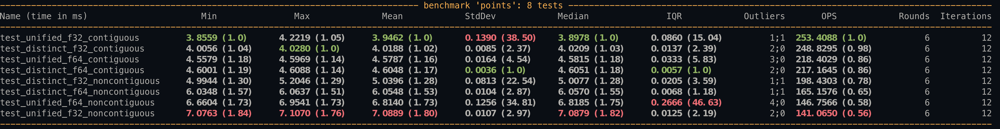

# H3 CUDA

A CUDA implementation of Uber's H3 [h3.geo_to_h3](https://uber.github.io/h3-py/api_reference#h3.geo_to_h3).

This converts WGS84 coordinates to H3 hex indices at a given resolution in a numpy array format.

## API

Package offers two functions: `geo_to_h3_unified` and `geo_to_h3_distinct`.

Functionality is the same, but unified accepts a single array (n,2) for the Latitude and Longitude while distinct for each (n,).
In general, `geo_to_h3_unified` has the highest performance, but benchmarks are recommended.

Blocks and threads are configured based on rough experiments for highest throughput. Benchmark given your use case for best results.

```python
def geo_to_h3_distinct(lat:np.ndarray, lng:np.ndarray, resolution:int, blocks:int=2048, threads:int=128) -> np.ndarray:
    """
    Indexes the location at the specified resolution, returning the index of the cell containing the location.
    This buckets the geographic point into the H3 grid.

    For optimal performance, `lat` and `lng` should be np.float32 and C_CONTIGUOUS
    If not, the system will align before the operation is performed

    If data is available in a single (n,2) array, consider `geo_to_h3_unified` as an alternative

    Parameters
    ----------
    lat : np.ndarray
        WGS Latitude
    lng : np.ndarray
        WGS Longitude
    resolution : int
        H3 Resolution
    blocks : int
        CUDA blocks for the operation, default 2048
    resolution : int
        CUDA threads for each block, default 128

    Returns
    -------
    np.ndarray
        H3 Resolutions - np.uint64
    """
    pass
```

```python
def geo_to_h3_unified(points:np.ndarray, resolution:int, blocks:int=2048, threads:int=128) -> np.ndarray:
    """
    Indexes the location at the specified resolution, returning the index of the cell containing the location.
    This buckets the geographic point into the H3 grid.

    For optimal performance, `points` should be np.float32 and C_CONTIGUOUS
    If not, the system will align before the operation is performed

    If data is available in a two (n,) arrays, consider `geo_to_h3_distinct` as an alternative

    Parameters
    ----------
    points : np.ndarray
        WGS Latitude/Longitude, (n,2)
    resolution : int
        H3 Resolution
    blocks : int
        CUDA blocks for the operation, default 2048
    resolution : int
        CUDA threads for each block, default 128

    Returns
    -------
    np.ndarray
        H3 Resolutions - (n,) np.uint64
    """
```

## Example

```python
import numpy as np
import h3.api.basic_int as h3_int
import h3cuda

rng = np.random.default_rng(0)
latitudes = (rng.random(500) * 2 - 1) * 90.0
longitudes = (rng.random(500) * 2 - 1) * 180.0
results = h3cuda.geo_to_h3_distinct(latitudes, longitudes, 4)
for idx in range(latitudes.shape[0]):
    assert h3_int.geo_to_h3(latitudes[idx], longitudes[idx], 4) == results[idx]
```

See `test.py` for more examples.

## Performance



Unified offers slightly better performance than distinct.

Recommendation is to use the form that matches data as provided.

## Limitations

Depending on hardware, maximum throughput happens around 20 million points in a set.

Note that round errors, introduced by requiring float32 instead of float64 in the GPU, can produce slightly different results when the point is on the edge of a hex.

Based on testing, the effect is small. It occurs less than 1% of the time and the error less than 0.1% of the hex size.

In short, the results are not verbatim, but are quite close for heatmaps or coarse selections.

## Building

Package is built and tested on Pop_OS 20.04, CUDA 11.4, gcc7, and an RTX 3090.

Github actions attempts to build the package as a wheel, but YMMV and building yourself is recommended.

1. Create python environment with parent directory's `Pipfile` - `pipenv install`
2. Adjust `setup.py` - notably `extra_compile_args` to point to your gcc and specific arch if required
3. Build `make wheel`. If successful, result is `dist/h3cuda*.whl`

`make all` will uninstall `h3cuda`, build the package, install, and run provided tests.

## Licenses

The H3 c code is [licensed](https://github.com/uber/h3/blob/master/LICENSE) under `Apache 2.0` by Uber. The original code can be found [here](https://github.com/uber/h3/tree/e0aae450ffa7a63a3b7982573c88325b42231332).

Some of the project configuration (notably most of `setup.py`) is licensed [BSD-2-Clause](https://github.com/rmcgibbo/npcuda-example/blob/master/LICENSE) by [rmcgibbo](https://github.com/rmcgibbo/npcuda-example).

The individual files are noted at the top as well.

All other code is licensed under MIT License.
